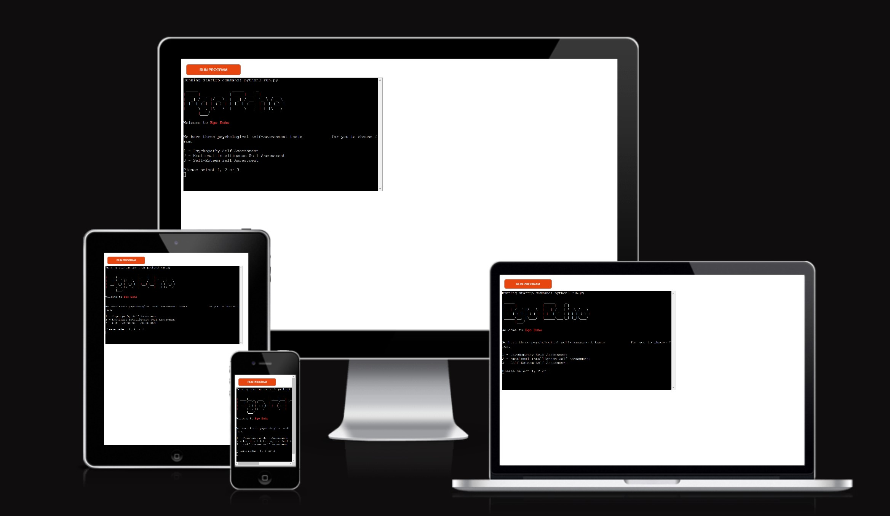
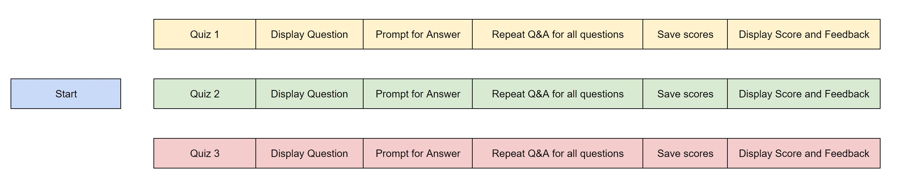
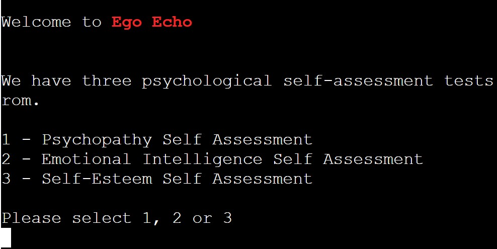
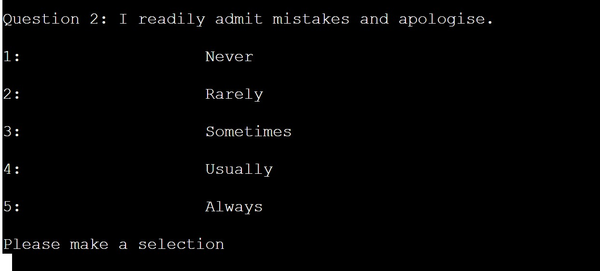

# Ego Echo - Self Assessment

# Introduction

We have three psychological self-assessment tests to choose from.

The score of feedback will be provided at the end of each test. As this is a self assessment, the recomendation is to answer questios as honestly as possible to get a more accurate score. 
No user information is saved, so the results are just for the user themselves.

 - Psychopathy Self Assessment
 - Emotional Intelligence Self Assessment
 - Self-Esteem Self Assessment

# Live Project

[View live project here](https://ego-echo-2697387bbbc4.herokuapp.com/)

## README Table Content

---

- [Introduction](#introduction)
- [User Experience](#ux)
  - [User Stories](#user-stories)
  - [Developer Goals](#goals)
- [Design](#design)
  - [Colours](#colours)
- [Logic](#Logic)
  - [Flowchart](#flowchart)
- [Features](#features)
  - [Logo and Menu](#logo-menu)
  - [Menu](#menu)
  - [Questions](#questions)
  - [Feedback](#feedback)
  - [Future Features](#future-features)
- [Storage Data](#storage)
  - [Creating Sheets](#creating-sheets)
  - [API Credentials](#api-credentials)
- [Technologies Used](#technologies)
  - [Languages Used](#languages)
  - [Python Packages](#python-Packages)
  - [Frameworks - Libraries - Programs Used](#frameworks-libraries-programs)
- [Testing](#testing)
  - [Functional Testing](#functional-testing)
  - [Validator Testing](#validator-testing)
  - [User Experience Testing](#ux-testing)
  - [Bugs](#bugs)
- [Deployment](#deployment)
  - [Local Deployment](#local-deployment)
  - [Heroku Deployment](#heroku-deployment)
- [References & Credit](#references-credit)

## <a name="ux">User Experience</a>

---

### <a name="user-stories">User Stories</a>

- As a user, I want to understand what the application does.
- As a user, I want to be able view possible quizes i can try.
- As a user, I want to be get a final score.
- As a user, I want to get general feedback around my score.

### <a name="goals">Developer Goals</a>

- As a developer, I want to build an an application that is easy to navigate.
- As a developer, I want the information (Questions and Possible Answers) stored in Google Sheets
- As a developer, I want to valiadate every user input.

## <a name="design">Design</a>

---

### <a name="colours">Colours</a>

The colours in the game are supplied by the Python [Colorama](https://pypi.org/project/colorama/) package. The use of colour was kept to a minimum and to highligh current quiz title.

## <a name="logic">Logic</a>

---

### <a name="flowchart">Flowchart</a>

## <a name="features">Features</a>

---

### <a name="logo-menu">Logo</a>

- When the user enters the website, they see the logo of the game. The user is then prompted to select which quiz they want to try 

### <a name="Menu">Menu</a>

- There are 3 self assessment quizes to choose from. 

### <a name="questions">Questions</a>

- The first question is display to the user and prompts for a reply. This will repeat until all the questions are done in that particular quiz.

### <a name="feedback">Show score and feedback</a>

- This will show the user ther score and provide some context around that score. The scoring system is tailored for each quiz.

### <a name="future-features">Future Features</a>

#### Averages:

I would like to compare user scores against the average score for the population 

## <a name="storage">Storage Data</a>

---

The only information stored in google sheets is the questions, answers and title of each quiz. The idea was that each sheet would contain the neccessary data for each of the 3 instances of the Quiz clas used.

Because the data was around a potentiall sensitve subject, i chose not to save any user details or responses. However, this could be added to in future by anonymising user information and just storing the results with any other relevant info.
The sheet is connected to the code through the Google Drive and the Google Sheet API by the Google Cloud Platform. This enables me to send and receive data as I had access to the Google Sheet API credentials. When deploying the project to Heroku, I added in the Config Vars to the credentials. As this is sensitive data, I also had to add the creds.json in the Git ignore file. This would ensure that these credentials are not pushed to the repository.

### Creating Sheets

- Navigate to [Google Sheets](https://docs.google.com/spreadsheets/u/0/).
- Create a Blank sheet.  
- Edit the sheet name.
- The name used must match the name called in the `open()` method.
- Input data if required.
- The `gspread` package allows many operations including retrieving, updating
  and adding new data.

### API Credentials

To enable access from the project to Google Sheets, credentials must be created and provided.

- Navigate to the [Google Cloud Platform](https://console.cloud.google.com/)
- Click "Select a project"
- Click "New Project".
- Enter the project name.
- Click "Create"
- From the project dashboard, select "APIs and services" and then "Library"
- Search for Google Drive API and enable it.
- Click "Create Credentials".-
- Select "Google Drive API" from the drop down list.
- Select "Application data" from the first set of radio buttons.
- Select "No, I', not using them" from the second set of radio buttons.
- Click "Done" and afterwards enter name and describtion for the service account details.
- Select a role of "Editor" from the options available.
- Click "Done" to create the service account.
- Click on the newly created service account on the credentials page.
- Select "Keys" from the top menu bar.
- Select "Create new key" from the "Add Key" menu.
- Select "JSON" and click "Create"
- The JSON file will be downloaded to your computer. Copy the contents into a creds.json file within the repository. Make sure to add this file to the `.gitignore` file as this is sensitive data. 

## <a name="technologies">Technologies Used</a>

---

### <a name="languages">Languages Used</a>

- [Python](https://www.python.org/)

### <a name="python-packages">Python Packages</a>

- [Gspread](https://pypi.org/project/gspread/): allows communication with Google Sheets
- [Colorama](https://pypi.org/project/colorama/): allows terminal text to be printed in different colours
- [google.oauth2.service_accoun](https://google-auth.readthedocs.io/en/stable/index.html): credentials used to validate credentials and grant access to Google service accounts
- [Pyfiglet] pyfiglet: Create logo

### <a name="frameworks-libraries-programs">Frameworks - Libraries - Programs Used</a>

- [GitHub](https://github.com/) was used for version control and site deployment.
- [Gitpod](https://gitpod.io/) is the Integrated Development Environment (IDE) chosen for this project.
- [Google Cloud](https://cloud.google.com/) was use for accessing a library of Google-based API services.
- [Google Drive API](https://developers.google.com/drive/api/guides/) was used for communicating with a cloud service to upload data.
- [Google Sheets API](https://developers.google.com/sheets/api/guides/concepts) was use for reading and writing automated data to a cloud-hosted spreadsheet file.
- [Heroku](https://id.heroku.com) was used to deploy the live project
- [PEP8](http://pep8online.com/) was used to validate all the Python code

### <a name="testing">Testing</a>

---

### <a name="functional-testings">Functional Testing</a>

Test:    
Display Logo - Yes
Display Welcome messgae - Yes
Display expected colour - Yes
Display Menu - Yes
Validate user input from Menu - Yes
Read information from Google Sheets - Yes
Display correct quiz based on user selection - Yes
Create instance of Quiz based on user selection - Yes
Display first question and possible answer for this quiz - Yes
Prompt for user to supply and answer - Yes
Validate user answer - Yes
Cycle through quiz questions - Yes
Save user answers in a list - Yes
Calulate score - Yes
Display score to user - Yes
Display feedback to user - Yes

### <a name="validator-testing">Validator Testing</a>

### PEP 8 Online

The [PEP8](https://pep8ci.herokuapp.com/) Validator Service was used to validate every Python file in the project to ensure there were no syntax errors in the project.

- No errors or warnings were found during the testing of the code in PEP8

### W3C Markup Validator

No errors or warnings were found during testing of the code in [W3C Markup Validator](https://validator.w3.org/).

---

### <a name="ux-testing">User Experience Testing</a>

#### User Stories

- As a user, I want to understand what the application does.
- Introdution message added for each quiz.

- As a user, I want to be able view possible quizes i can try.
- Menu added to display options

- As a user, I want to be get a final score.
- User score displayed at end of Questions and Answers

- As a user, I want to get general feedback around my score.
- Depending on their score, user is given contextual feedback

#### Site Owner Goals

- As a developer, I want to build an an application that is easy to navigate.
- Menu system is clear and straight forward. Same input system in place for menu selection and answer selection. Feedback is given in case of wrong input

- As a developer, I want the information (Questions and Possible Answers) stored in Google Sheets
- 3 google sheets are set up. One for each quiz type. This assisted in designing Quiz class and also kept static text data away from main code

- As a developer, I want to valiadate every user input.
- The user has two areas to enter input - the menu and when answering a question. Similar code was used for both validations and allowed for consistent feedback to be given.

### <a name="Bugs">Bugs</a>

### Fixed Bugs

- Bug - Validating user input for 1 to 3 responses when one of the quizes needed 1 to 5
- Solution - User variable to check length and use that as max value

- Bug - Scores showing incorrecty for one quiz
- Solution - Saved scores as a list and then manipulated that list afterwards.

### Unsolved Bugs

I tried to fix text as "line to long" error but this then created visual issues with large gaps in text

## <a name="deployment">Deployment</a>

---

This application has been deployed by using the Heroku cloud platform.
You can find a [template](https://github.com/Code-Institute-Org/python-essentials-template) prepared by Code Institute that is designed to display this application in a modern web browser. This allows the project to be accessible for users without the need of any third party software other than an Internet browser application.

### <a name="local-deplyoment">Local Deployment</a>

Gitpod IDE is the development environment for this project.

Heroku will need the requirements file to deploy the project succesfully.

- To create the project's requirements use: `pip3 freeze > requirements.txt`.
- Afterwards push latest code to Github.

#### Clone this project by following the steps:

1. Navigate to the main page of the repository on GitHub.com.
2. Click Code above the list of files.
3. You will be provided with three options to choose from, HTTPS, SSH, or GitHub CLI
4. Click the clipboard icon in order to copy the URL
5. Open the terminal
6. Change the current working directory to the location where you want the cloned directory
7. Type git clone, and then paste the URL you copied in step 4

### <a name="heroku-deplyoment">Heroku Deployment</a>

This project uses the services available at [Heroku] (https://www.heroku.com). Heroku is a Platform as a Service (PaaS) that allows users to create, deploy, and control applications in a cloud environment.

1. Select "New" in the top-right corner in the Heroku Dashboard after log-in.
2. Select the "Create new app" button from the dropdown menu.
3. Assign a unique name to your application.
4. Next select your region
5. Click on the "Create App" button
6. Navigate to the created application and click on "Settings" Tab.
7. Click "Reveal Config Vars".
8. Enter `PORT` into the Key box and `8000` into the Value box and click the Add button.
9. Next enter `CREDS` into the Key box and credentials (ie. from `creds.json`) into the Value box.
10. Scroll down to the Buildpack section click Add Buildpack select Python and click "Save Changes".
11. From the same menu select Node.js and click Save Changes.
12. Navigate to the "Deploy" tab and select the desired deployment method.
13. Select "Enable Automatic Deploy" to rebuild your project automatically every time you push a new commit.
14. Select "Manual Deployment" to manually deploy from your desired branch on will.

## <a name="#references-credit">References & Credit</a>

---
- LoveSandwiches tutorial was very useful around setting up the project, connecting to Googlesheets and deploying project
- https://psychcentral.com/quizzes/self-esteem-test
- https://stackoverflow.com/questions/23294658/asking-the-user-for-input-until-they-give-a-valid-response
- https://stackoverflow.com/questions/6632188/explicitly-select-items-from-a-list-or-tuple

